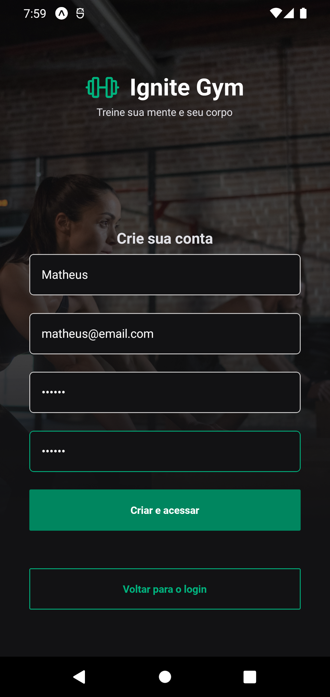
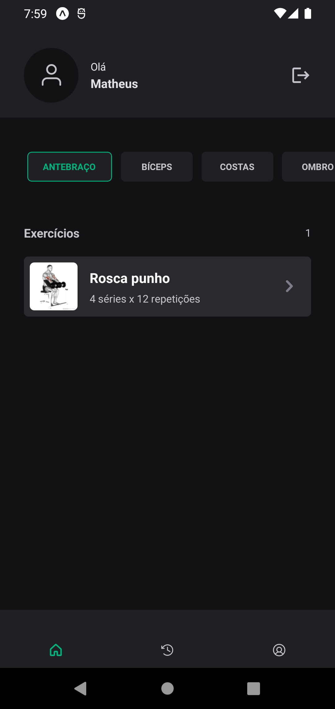
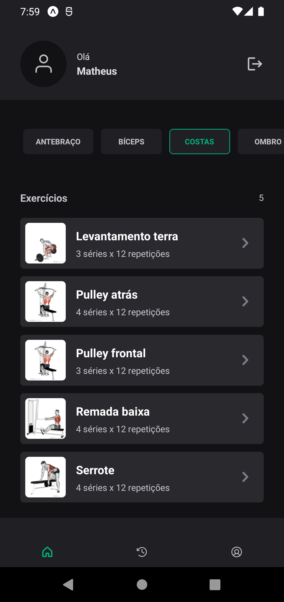
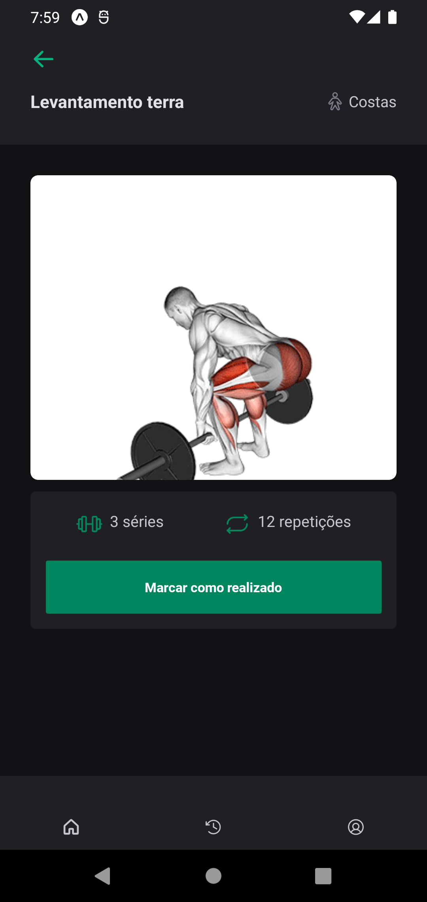
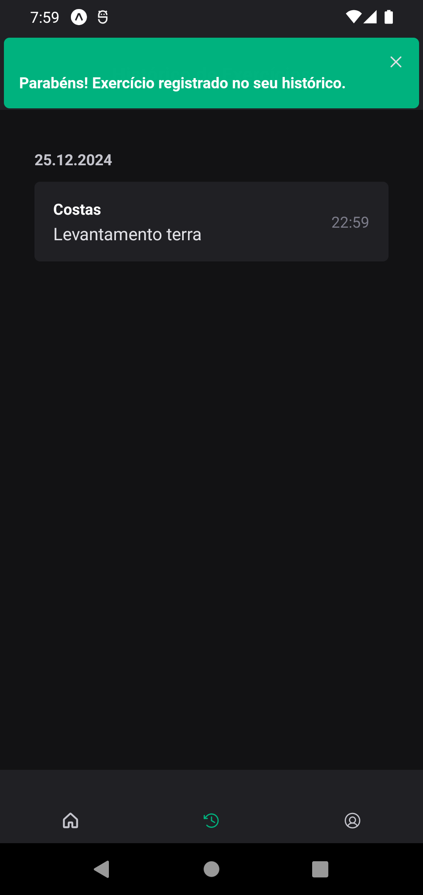

# 📱 GYM

Gym App é uma aplicação de gerenciamento de treinos desenvolvida em React Native com Expo Router. O objetivo é fornecer uma experiência intuitiva para os usuários acompanharem seus exercícios, histórico de treinos, e gerenciarem seu perfil.

## Funcionalidades

- Cadastro de usuários.

- Login e autenticação segura.

- Registro de exercícios como concluídos.

- Visualização do histórico de exercícios realizados.

- Atualização da foto de perfil.

- Alterar senha de acesso.

- Exploração de grupamentos musculares.

## Tecnologias e Bibliotecas Utilizadas

Dependências Principais

- React Native: Framework para desenvolvimento mobile.

- Expo Router: Roteamento baseado em arquivos para aplicações Expo.

- NativeWind: Integração entre Tailwind CSS e React Native.

- Axios: Cliente HTTP para comunicação com a API.

- React Hook Form: Gerenciamento de formulários.

- Zod: Validação de dados e schemas.

- Async Storage: Armazenamento local de dados.

Expo SDK

- expo-file-system: Manipulação de arquivos.

- expo-image-picker: Seleção de imagens.

- expo-font: Gerenciamento de fontes.

- expo-splash-screen: Controle da tela de splash.

- expo-web-browser: Manipulação de browsers internos.

Interface do Usuário

- Gluestack UI: Biblioteca de componentes UI para React Native.

- @expo-google-fonts/roboto: Fontes otimizadas para Expo.

- react-native-svg: Suporte a SVG no React Native.

## 📸 Imagens de Exemplo













## ⚙️ Pré-requisitos

- **Node.js** instalado.
- Para rodar no smartphone:
  - Instale o aplicativo **Expo Go**.
- Para rodar no computador:
  - Use um emulador Android (recomendado).

---

## 🚀 Instalação e Execução

1. Clone este repositório:

   ```bash
   git clone https://github.com/seu-usuario/seu-repositorio.git
   cd seu-repositorio

   ```

2. Instale as dependências:

npm install

3. Inicie o servidor do Expo:

npx expo start -c
